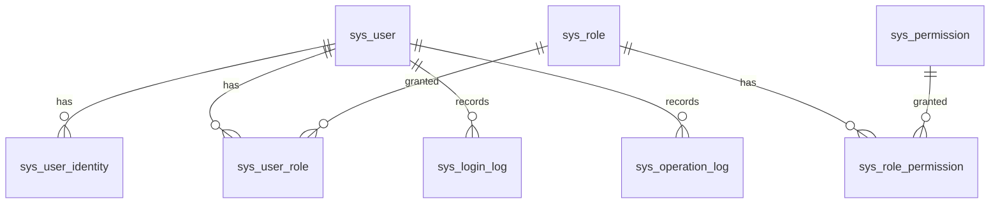

# 03 数据模型设计

## 1. 数据库约定

### 1.1 通用规范

| 项 | 约定 |
| --- | --- |
| 表名 | 小写下划线、单数；系统表前缀 `sys_`，业务表前缀 `biz_` |
| 字段名 | snake_case |
| 主键 | `BIGSERIAL` 自增 `id`；对外引用如需防遍历，后续加 `uuid` 列 |
| 审计字段 | 所有业务表含 `created_at`、`updated_at`、`created_by`、`updated_by`、`deleted_at` |
| 软删除 | `deleted_at TIMESTAMPTZ NULL`；查询默认过滤；唯一约束用部分唯一索引 |
| 时间 | 统一 `TIMESTAMPTZ`（UTC 存储，应用层转时区显示） |
| 金额 | `NUMERIC(18,4)`（后续合同金额字段） |
| JSON | `JSONB` |
| 约束命名 | `pk_表名`、`uq_表名_字段`、`ix_表名_字段`、`fk_表名_字段`、`chk_表名_字段` |

### 1.2 变更纪律

- 所有表结构变更必须通过 Alembic 迁移文件，禁止手工改库。
- 破坏性变更（删列、改类型、改约束）须评审并附数据迁移方案。

## 2. ER 概览

## 3. 表结构明细

### 3.1 sys_user — 用户表

| 字段 | 类型 | 约束 | 说明 |
| --- | --- | --- | --- |
| id | BIGSERIAL | PK | |
| username | VARCHAR(64) | NOT NULL, UQ(部分) | 登录名；钉钉自动创建用户时用 union_id 派生 |
| password_hash | VARCHAR(255) | NULL | 本地密码（argon2id）；纯钉钉用户可空 |
| display_name | VARCHAR(128) | NOT NULL | 显示名 |
| avatar_url | VARCHAR(512) | NULL | 头像 |
| email | VARCHAR(128) | NULL | |
| phone | VARCHAR(32) | NULL | |
| status | SMALLINT | NOT NULL, DEFAULT 1 | 1=启用 0=禁用（chk） |
| is_super_admin | BOOLEAN | NOT NULL, DEFAULT false | 超管标记 |
| must_change_password | BOOLEAN | NOT NULL, DEFAULT false | 首次登录/重置后强制改密 |
| last_login_at | TIMESTAMPTZ | NULL | 最近登录时间 |
| last_login_ip | VARCHAR(64) | NULL | |
| created_at / updated_at | TIMESTAMPTZ | NOT NULL | |
| created_by / updated_by | BIGINT | NULL | 操作人 id |
| deleted_at | TIMESTAMPTZ | NULL | 软删除 |

> 唯一性：`uq_sys_user_username` 为部分唯一索引 `WHERE deleted_at IS NULL`。

### 3.2 sys_user_identity — 用户外部身份绑定表

支持同一用户多种登录方式（钉钉/后续企业微信/短信），也支持一个 unionId 唯一对应一个用户。

| 字段 | 类型 | 约束 | 说明 |
| --- | --- | --- | --- |
| id | BIGSERIAL | PK | |
| user_id | BIGINT | NOT NULL, FK→sys_user | |
| provider | VARCHAR(32) | NOT NULL | `dingtalk` 等 |
| union_id | VARCHAR(128) | NOT NULL | 钉钉 unionId（跨应用唯一） |
| open_id | VARCHAR(128) | NULL | 钉钉 openId |
| raw_profile | JSONB | NULL | 登录时原始用户信息快照 |
| is_bound | BOOLEAN | NOT NULL, DEFAULT true | 是否仍有效绑定 |
| created_at / updated_at | TIMESTAMPTZ | NOT NULL | |

> 唯一约束：`uq_sys_user_identity_provider_union` = (provider, union_id)。

### 3.3 sys_role — 角色表

| 字段 | 类型 | 约束 | 说明 |
| --- | --- | --- | --- |
| id | BIGSERIAL | PK | |
| code | VARCHAR(64) | NOT NULL, UQ | 角色编码：`super_admin` / `admin` / `user` |
| name | VARCHAR(128) | NOT NULL | 角色名 |
| description | VARCHAR(512) | NULL | |
| is_builtin | BOOLEAN | NOT NULL, DEFAULT false | 内置角色禁止删除 |
| status | SMALLINT | NOT NULL, DEFAULT 1 | |
| created_at / updated_at | TIMESTAMPTZ | NOT NULL | |

### 3.4 sys_permission — 权限点表

| 字段 | 类型 | 约束 | 说明 |
| --- | --- | --- | --- |
| id | BIGSERIAL | PK | |
| code | VARCHAR(128) | NOT NULL, UQ | 权限编码，如 `config:dingtalk:write` |
| name | VARCHAR(128) | NOT NULL | |
| module | VARCHAR(64) | NOT NULL | 所属模块（auth/admin/contract...） |
| description | VARCHAR(512) | NULL | |
| created_at / updated_at | TIMESTAMPTZ | NOT NULL | |

### 3.5 sys_user_role — 用户-角色关联

| 字段 | 类型 | 约束 |
| --- | --- | --- |
| user_id | BIGINT | NOT NULL, FK；联合 PK |
| role_id | BIGINT | NOT NULL, FK；联合 PK |
| created_at | TIMESTAMPTZ | NOT NULL |

### 3.6 sys_role_permission — 角色-权限关联

| 字段 | 类型 | 约束 |
| --- | --- | --- |
| role_id | BIGINT | NOT NULL, FK；联合 PK |
| permission_id | BIGINT | NOT NULL, FK；联合 PK |
| created_at | TIMESTAMPTZ | NOT NULL |

### 3.7 sys_config — 系统配置表（业务可配置项）

| 字段 | 类型 | 约束 | 说明 |
| --- | --- | --- | --- |
| id | BIGSERIAL | PK | |
| config_key | VARCHAR(128) | NOT NULL, UQ | 如 `dingtalk` |
| config_value | JSONB | NOT NULL | 配置内容（JSON） |
| value_type | VARCHAR(32) | NOT NULL, DEFAULT 'json' | json / text / number / boolean |
| is_encrypted | BOOLEAN | NOT NULL, DEFAULT false | 是否整值加密（敏感配置） |
| description | VARCHAR(512) | NULL | |
| version | INTEGER | NOT NULL, DEFAULT 1 | 乐观锁 |
| updated_by | BIGINT | NULL | |
| updated_at | TIMESTAMPTZ | NOT NULL | |
| created_at | TIMESTAMPTZ | NOT NULL | |

> 加密策略：敏感字段（client_secret）在 JSON 内单独加密存储（JSON 键 `client_secret_enc`）；`is_encrypted=true` 表示整体加密。读取时由配置服务解密并缓存至 Redis。

### 3.8 sys_login_log — 登录日志表

| 字段 | 类型 | 约束 | 说明 |
| --- | --- | --- | --- |
| id | BIGSERIAL | PK | |
| user_id | BIGINT | NULL, FK→sys_user | 失败时可能为空 |
| login_method | VARCHAR(32) | NOT NULL | `local` / `dingtalk` |
| success | BOOLEAN | NOT NULL | |
| fail_reason | VARCHAR(255) | NULL | |
| ip | VARCHAR(64) | NULL | |
| user_agent | VARCHAR(512) | NULL | |
| trace_id | VARCHAR(64) | NULL | 请求链路 id |
| created_at | TIMESTAMPTZ | NOT NULL | |

> 建议后续对该表按月分区或归档，防止膨胀。

### 3.9 sys_operation_log — 操作审计表

| 字段 | 类型 | 约束 | 说明 |
| --- | --- | --- | --- |
| id | BIGSERIAL | PK | |
| user_id | BIGINT | NULL | |
| module | VARCHAR(64) | NOT NULL | admin/auth... |
| action | VARCHAR(64) | NOT NULL | `config.dingtalk.update` 等 |
| method | VARCHAR(8) | NOT NULL | GET/POST/PUT/DELETE |
| path | VARCHAR(255) | NOT NULL | |
| request_body | JSONB | NULL | 脱敏后 |
| response_code | INTEGER | NULL | 业务 code |
| ip | VARCHAR(64) | NULL | |
| user_agent | VARCHAR(512) | NULL | |
| duration_ms | INTEGER | NULL | |
| trace_id | VARCHAR(64) | NULL | |
| created_at | TIMESTAMPTZ | NOT NULL | |

### 3.10 sys_risk_rule — 合同风险规则表

| 字段 | 类型 | 约束 | 说明 |
| --- | --- | --- | --- |
| id | BIGSERIAL | PK | |
| code | VARCHAR(64) | NOT NULL，部分唯一 | 规则编码（`risk:rule` 模块） |
| name | VARCHAR(128) | NOT NULL | 规则名称 |
| category | VARCHAR(32) | NOT NULL | payment/breach/subject/ip/dispute/other |
| severity | VARCHAR(16) | NOT NULL | high/medium/low |
| keywords | JSONB | NOT NULL | 关键词列表 |
| description | TEXT | NOT NULL | 风险说明 |
| suggestion | TEXT | NOT NULL | 处置建议 |
| enabled | BOOLEAN | NOT NULL | 是否启用 |
| sort_order | INTEGER | NOT NULL | 排序 |
| created_at/updated_at/deleted_at/created_by/updated_by | — | 审计 | 通用混入 |

详细设计见《10-合同风险规则配置设计》。

### 3.11 sys_risk_rule_custom — 个人风险规则副本表

| 字段 | 类型 | 约束 | 说明 |
| --- | --- | --- | --- |
| id | BIGSERIAL | PK | |
| user_id | BIGINT | NOT NULL, FK sys_user | 所属用户 |
| code | VARCHAR(64) | NOT NULL | 全局规则编码 |
| name/category/severity/keywords/description/suggestion/enabled/sort_order | — | NOT NULL | 个人快照字段，结构同 sys_risk_rule |
| created_at/updated_at | TIMESTAMPTZ | NOT NULL | |
| 唯一约束 | `(user_id, code)` | UQ | 同用户同编码仅一条 |

个人副本优先于全局模板；删除即恢复跟随全局默认。

## 4. 种子数据（初始迁移写入）

| 类型 | 内容 |
| --- | --- |
| 角色 | `super_admin`（超管）、`admin`（管理员）、`user`（普通用户），均为内置角色 |
| 权限点 | `auth:login`、`auth:me`、`config:dingtalk:read`、`config:dingtalk:write`、`config:dingtalk:test`、`user:manage`（已实现）等 |
| 角色-权限 | super_admin 关联全部权限；admin 关联基础权限 + `user:manage` + `risk:rule:manage`；user 关联基础权限 |
| 超管账号 | 由环境变量 `ADMIN_USERNAME` / `ADMIN_PASSWORD` 在应用首次启动时幂等创建，`is_super_admin=true`，`must_change_password=true` |
| 钉钉配置 | `sys_config.config_key='dingtalk'` 初始为空配置（JSON：`{client_id, client_secret_enc, corp_id, redirect_uri, enabled, updated_at}`，enabled=false），等待超管配置 |

## 5. Redis 键设计

| 键 | 类型 | TTL | 用途 |
| --- | --- | --- | --- |
| uth:refresh:{user_id}:{jti} | STRING | 7d | 记录 refresh token，支持吊销与轮换 |
| uth:refresh:user:{user_id} | SET | 随成员过期 | 用户维度 refresh jti 集合，用于改密/禁用后吊销全部会话 |
| `auth:blacklist:{jti}` | STRING | 剩余有效期 | access token 吊销（登出/改密） |
| `oauth:dingtalk:state:{state}` | STRING | 10min | OAuth state 防 CSRF，一次性 |
| `ratelimit:login:{ip}` | STRING | 1min | 登录接口限流 |
| `cache:config:{config_key}` | STRING | 5min | 业务配置缓存 |

> 键命名规范：`业务域:对象:标识`；统一封装在 `app/integrations/redis` 中，禁止散落字符串。

## 6. 数据一致性要点

1. 用户唯一：`username` 部分唯一索引 + 应用层校验。
2. 绑定唯一：`(provider, union_id)` 唯一约束，防止同一钉钉账号重复建户。
3. 配置并发：`sys_config.version` 乐观锁，防止并发覆盖。
4. 事务：创建钉钉用户 = 创建 sys_user + sys_user_identity + 默认角色绑定，在单个 Service 事务内完成。
## 7. 索引与约束补全

| 表 | 索引 | 类型 | 用途 |
| --- | --- | --- | --- |
| sys_user | `uq_sys_user_username` (username) WHERE deleted_at IS NULL | 部分唯一 | 登录名唯一 |
| sys_user_identity | `uq_sys_user_identity_provider_union` (provider, union_id) | 唯一 | 绑定唯一 |
| sys_user_identity | `ix_sys_user_identity_user_id` (user_id) | 普通 | 按用户查绑定 |
| sys_user_role | 联合主键 (user_id, role_id) | 主键 | |
| sys_role_permission | 联合主键 (role_id, permission_id) | 主键 | |
| sys_config | `uq_sys_config_key` (config_key) | 唯一 | |
| sys_login_log | `ix_sys_login_log_created_at` (created_at) | 普通 | 按时间查询/归档 |
| sys_login_log | `ix_sys_login_log_user_id` (user_id) | 普通 | 按用户查询 |
| sys_operation_log | `ix_sys_operation_log_created_at` (created_at) | 普通 | |
| sys_operation_log | `ix_sys_operation_log_user_id` (user_id) | 普通 | |

**外键约束策略**：一律 `ON DELETE RESTRICT`（禁止级联删除业务数据），删除一律走软删除；审计日志外键允许 NULL，用户删除后日志仍保留（RESTRICT 不阻止软删除）。

## 8. 数据库账号与连接管理

| 账号 | 权限 | 用途 |
| --- | --- | --- |
| 应用账号 | 仅 DML（SELECT/INSERT/UPDATE/DELETE）+ 序列 | 应用运行时连接，最小权限 |
| 迁移账号 | DDL + DML | 执行 Alembic 迁移 |
| 只读账号（后续） | SELECT | 报表/BI |

- 连接配置（host/port/库名/账号/密码）全部走环境变量；应用账号与迁移账号分离，生产禁用超级用户运行应用。
- 字符集：UTF-8（库级 `C.UTF-8` 或 `en_US.UTF-8`）；时间统一 `TIMESTAMPTZ`（UTC 存储），应用层按 `Asia/Shanghai` 展示。