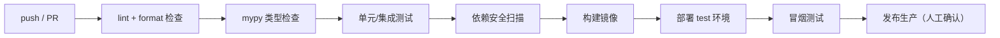

# 07 工程规范与代码规范

> 本文档定义仓库结构、Git 工作流、代码风格、注释、测试、日志等工程约束。目标是：任何协作者都能写出风格一致、可维护、可测试的代码。

## 1. 仓库结构

```
contract-risk/
├── backend/                    # 后端服务
│   ├── app/
│   │   ├── api/                # API 层：路由 + 依赖
│   │   │   ├── v1/
│   │   │   │   ├── auth/       # 认证相关路由
│   │   │   │   └── admin/      # 超管配置路由
│   │   │   └── deps.py         # 公共依赖（当前用户/权限校验）
│   │   ├── core/               # 基础设施：配置/安全/异常/日志
│   │   ├── domain/             # 领域层：实体/枚举/常量/领域规则
│   │   ├── integrations/       # 外部集成：钉钉/Redis/加密/HTTP
│   │   ├── models/             # SQLAlchemy ORM 模型
│   │   ├── repositories/       # 数据访问层
│   │   ├── schemas/            # Pydantic DTO（请求/响应）
│   │   ├── services/           # 业务用例层
│   │   └── main.py             # 应用入口
│   ├── migrations/             # Alembic 迁移
│   ├── tests/                  # pytest 测试
│   ├── pyproject.toml
│   ├── .env.example
│   └── Dockerfile（后续）
├── frontend/                   # 前端 SPA
│   ├── src/
│   │   ├── api/                # axios 封装与接口定义
│   │   ├── components/         # 通用/业务组件
│   │   ├── router/             # 路由 + 守卫
│   │   ├── stores/             # Pinia 状态
│   │   ├── utils/              # 工具
│   │   └── views/              # 页面（login/config/...）
│   ├── package.json
│   └── vite.config.ts
├── docs/                       # 文档中心
│   └── design/                 # 设计文档
├── .gitignore
├── .editorconfig
└── docker-compose.yml（后续）
```

## 2. Git 工作流

- `main` 分支受保护，禁止直接推送；通过 PR + 评审合并。
- 功能开发在 `feature/xxx` 分支；修复在 `fix/xxx`；发布打 tag。
- 提交信息遵循 Conventional Commits：
  `feat(scope): 描述` / `fix(scope): 描述` / `docs: ...` / `refactor: ...` / `test: ...` / `chore: ...`
- **禁止提交**：`.env`、密钥文件、日志、构建产物、IDE 配置。

## 3. Python 代码规范

### 3.1 基础要求

- Python 3.12+；全量类型注解；mypy strict 通过。
- 格式化：black + ruff；import 排序 ruff（I 规则）。
- 文件名/目录：snake_case；类：PascalCase；函数/变量：snake_case；常量：UPPER_SNAKE；私有：`_` 前缀。

### 3.2 注释规范（重点）

| 场景 | 要求 |
| --- | --- |
| 公共函数/类/方法 | 必须写 Google 风格 docstring：功能、参数、返回、异常 |
| 关键算法/业务规则 | 必须注释"为什么这么做"，而非复述代码 |
| 复杂分支 | 说明意图与边界条件 |
| 禁止 | 废话注释（`# 加 1`）、代码行尾无意义注释、注释掉的死代码（用 git 历史） |

示例：

```python
def exchange_code_for_token(client_id: str, client_secret: str, auth_code: str) -> str:
    """用钉钉授权码换取用户 access_token。

    说明：authCode 为一次性凭证，仅在服务端使用，绝不下发前端。
    参考：https://open.dingtalk.com/document/orgapp/obtain-user-token

    Args:
        client_id: 钉钉应用 Client ID（原 AppKey）。
        client_secret: 钉钉应用 Client Secret（原 AppSecret，调用方已解密）。
        auth_code: 钉钉授权回调返回的一次性授权码。

    Returns:
        钉钉用户 access_token。

    Raises:
        DingTalkApiError: 钉钉接口调用失败。
    """
    ...
```

### 3.3 分层依赖规则

- 依赖方向：`api → services → repositories → models/domain`。
- 禁止反向导入；禁止 `services` 直接依赖 `api`。
- 禁止在 `services`/`api` 中拼 SQL；禁止在 `repositories` 中写业务规则。
- 跨层数据传递使用 Pydantic schema / 领域对象，禁止传递 ORM 对象到 API 层之外（查询场景按需）。

### 3.4 异常规范

- 业务异常：抛 `BizException(code, message)`，由全局处理器转换为统一响应。
- 系统异常：记录 ERROR 日志，对外返回模糊信息 + `request_id`。
- 禁止捕获后静默吞掉；禁止将内部异常细节直接透传给前端。

## 4. 前端代码规范

- TypeScript `strict: true`；ESLint + Prettier 统一格式。
- 组件：PascalCase 文件；页面放 `views/`，可复用组件放 `components/`。
- 业务逻辑放 stores/API 层，组件内不直接写接口调用细节。
- 禁止 `any` 泛滥；接口类型在 `api/` 统一定义。
- 注释：关键业务逻辑、复杂状态流转必须说明。

## 5. 数据库规范

- 所有结构变更走 Alembic 迁移（`alembic revision -m "描述"`）。
- 迁移文件必须可回滚（upgrade/downgrade 成对）。
- 禁止在迁移中引入不可逆操作而不评审；删列前确认无引用。
- 字段/表命名遵守《03-数据模型设计》。

## 6. 测试规范

- 框架：pytest + httpx AsyncClient（集成测试走真实 API 层）。
- 隔离：测试使用独立测试库（或事务回滚）；Redis 使用独立 db（编号通过测试环境变量配置，与开发库隔离）或 fakeredis。若必须使用共享库，测试前显式设置 `ALLOW_DESTRUCTIVE_TEST_DB=1`，严禁静默清空开发/生产数据。
- 命名：`test_<场景>_<期望>`。
- 覆盖要求：核心链路（登录、钉钉回调、配置读写、权限校验）必须覆盖，目标 ≥ 80%（后续定基线）。
- 每个 bug 修复应附带回归测试。

## 7. 日志规范

- 结构化 JSON 输出；字段：`time`、`level`、`logger`、`message`、`request_id`、`user_id`、`path`、`duration_ms`、`extra`。
- 级别：DEBUG（调试）、INFO（业务事件）、WARN（可恢复异常）、ERROR（系统错误）。
- 业务事件（登录成功/失败、配置变更、令牌刷新失败）记 INFO/WARN 并落审计表。
- 脱敏：密码、token、client_secret、Cookie 等字段一律掩码（日志过滤器统一处理）。
- 全链路：中间件注入 `request_id`，日志与响应头一致。

## 8. 代码评审清单（PR 必查）

- [ ] 符合分层依赖，无跨层调用
- [ ] 无明文密钥/凭据，无 `.env` 提交
- [ ] 异常处理符合规范（BizException/全局处理），无静默吞异常
- [ ] 错误码、响应格式符合《05-API 设计规范》
- [ ] 公共接口有 docstring，关键逻辑有注释
- [ ] 数据库变更走迁移且有回滚
- [ ] 核心链路有测试
- [ ] 文档已同步（接口/设计变更更新 docs）
- [ ] lint/format/type check 通过
## 9. CI/CD 流水线（Phase 1 收尾落地）



- 分支策略：`feature/*` → PR → `main`；main 通过 CI 后自动部署 test 环境。
- 安全扫描：后端 `pip-audit`，前端 `npm audit`，镜像扫描（trivy，后续）。
- 产物：后端 Docker 镜像（带版本 tag），前端静态包（带版本 tag）。

## 10. 发布与回滚

- 版本号：SemVer（x.y.z）；git tag 与镜像 tag 一致。
- 数据库迁移先行（Alembic upgrade），应用代码后发；迁移必须可回滚（downgrade）。
- 发布失败：回滚应用镜像；迁移一般不回滚（除非有 downgrade 且无数据影响，须评审）。
- 发布检查单：备份完成 → 迁移 → 部署 → 冒烟 → 观察告警。

## 11. 前端补充规范

- 表单：必填/格式校验统一（Element Plus rules），错误提示与后端错误码对应。
- 请求：loading 状态管理；401 自动刷新重放一次；网络错误统一提示。
- 关键操作（如保存配置）二次确认。
- 页面组件业务逻辑不超过约 200 行，超出则拆分 store/composable。